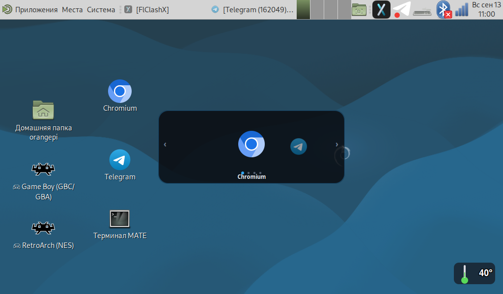
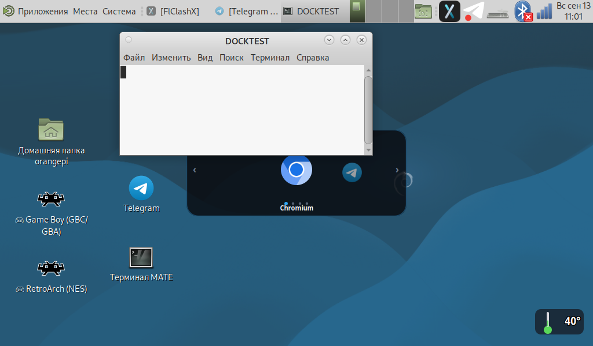

# Виджеты рабочего стола для Orange Pi Zero 3W (X11 / MATE / GTK3)

Два лёгких виджета для сенсорного рабочего стола на Orange Pi Zero 3W
(Debian 13 Trixie, MATE, X11, экран 1024×600): **карусель приложений** и
**индикатор температуры CPU**. Написаны на Python 3 + GTK3 + Cairo, без тяжёлых
зависимостей (память ~50 МБ на виджет против ~900 МБ у Chromium-оверлея).



## Возможности

### 🎠 Карусель приложений (`app-carousel.py`)
- Закреплена по центру рабочего стола, **не перекрывает окна приложений**
- **Не исчезает** при «показать рабочий стол» (Fn+Enter / Ctrl+Alt+D)
- Плавная прокрутка: колесо мыши, стрелки ‹ ›, **свайп пальцем** на сенсоре
- Тап по центральной иконке — запуск приложения; тап по боковой — доводит в центр
- Эффект глубины: центральная иконка крупнее, боковые затухают
- Точки-индикаторы, подпись центрального приложения
- Стиль AMOLED (чёрный полупрозрачный, скруглённые углы, голубой акцент)

Ярлыки по умолчанию: **Chromium, Telegram, Терминал (MATE), RetroArch (NES)**
— список задаётся в массиве `APPS` в начале скрипта.

### 🌡 Индикатор температуры CPU (`cpu-temp-float.py`)
- Плавающий полупрозрачный виджет-градусник в правом нижнем углу
- Рисуется Cairo (колба + ртуть), цифры температуры
- Цвет меняется по нагреву: зелёный < 50°, жёлтый < 70°, красный ≥ 70°
- Обновление каждые 5 секунд
- Перетаскивается мышью; средний клик — закрыть



## Требования

- Python 3 с PyGObject (`python3-gi`), Cairo (`python3-cairo`)
- GTK 3, запущенный X-сервер (`:0`) с WM, совместимым с EWMH (marco/MATE)
- Для иконок: `librsvg2-common` (если используются SVG)
- Опционально: `xdotool`, `scrot` (для диагностики)

## Установка

```bash
# 1. Скопировать скрипты
mkdir -p ~/.local/bin
cp app-carousel.py cpu-temp-float.py ~/.local/bin/
chmod +x ~/.local/bin/app-carousel.py ~/.local/bin/cpu-temp-float.py

# 2. Добавить в автозапуск
mkdir -p ~/.config/autostart
cp autostart/*.desktop ~/.config/autostart/

# 3. Запустить сейчас (в фоне)
DISPLAY=:0 XAUTHORITY=$HOME/.Xauthority ~/.local/bin/app-carousel.py &
DISPLAY=:0 XAUTHORITY=$HOME/.Xauthority ~/.local/bin/cpu-temp-float.py &
```

## Управление каруселью

| Действие | Что делает |
|---|---|
| Колесо мыши / стрелки ‹ › | прокрутка карусели |
| Свайп пальцем (сенсор) | прокрутка (следит за пальцем) |
| Тап по центральной иконке | запуск приложения |
| Тап по боковой иконке | доводит её в центр |
| Средний клик | закрыть виджет |

## Почему окно имеет тип DOCK + «ниже всех окон»

Главная тонкость (проверено экспериментально на marco):

| Тип окна | Поведение |
|---|---|
| `NORMAL` + `keep_above` | висит поверх всех окон — мешает работать |
| `NORMAL` + `keep_below` | окна перекрывают, но **Fn+Enter (показать рабочий стол) скрывает виджет** (WM делает unmap) |
| `DESKTOP` | не скрывается, но оказывается **под Caja** (иконки стола) — не виден |
| **`DOCK` + `keep_below`** | ✅ не скрывается, окна перекрывают, виден над иконками стола |

```python
self.set_type_hint(Gdk.WindowTypeHint.DOCK)
self.set_keep_below(True)
self.set_skip_taskbar_hint(True)
self.set_skip_pager_hint(True)
self.set_accept_focus(False)
```

Если виджет «пропал» — проверьте состояние окна:
```bash
WID=$(DISPLAY=:0 xdotool search --name "^app-carousel$" | tail -1)
xprop -id $WID _NET_WM_STATE _NET_WM_WINDOW_TYPE
xwininfo -id $WID | grep "Map State"      # IsUnMapped = WM скрыл окно
```

## Свайп ≠ клик

Чтобы прокрутка пальцем не превращалась в случайный запуск приложения:
- смещение > 14 px → это **свайп** (прокрутка, карусель следует за пальцем)
- касание без смещения, короче 0.7 с → это **тап** (запуск / центрирование)

## Настройка

Основные параметры — в начале `app-carousel.py`:

```python
W, H = 380, 150      # размер виджета
STEP = 96.0          # шаг между иконками
ICON = 54            # базовый размер иконки
APPS = [             # (подпись, файл иконки, команда запуска)
    ("Chromium", "/usr/share/icons/hicolor/256x256/apps/chromium.png", "chromium"),
    ...
]
```

Цвета — константы `BG`, `FG`, `ACCENT`, `OK`, `WARN`, `BAD`.

## Совместимость

Разработано и проверено на:
- Orange Pi Zero 3W (Allwinner A733, arm64), Debian 13 Trixie, MATE 1.26, marco
- Экран 1024×600 (HDMI + USB-тач)

Скрипты используют X11 — на Wayland не проверялись.

## Лицензия

MIT
