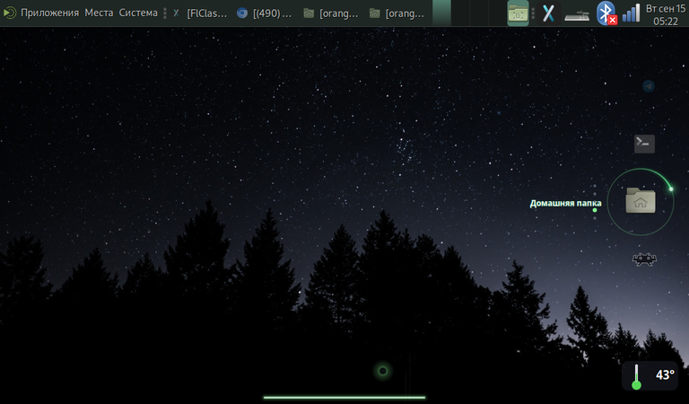
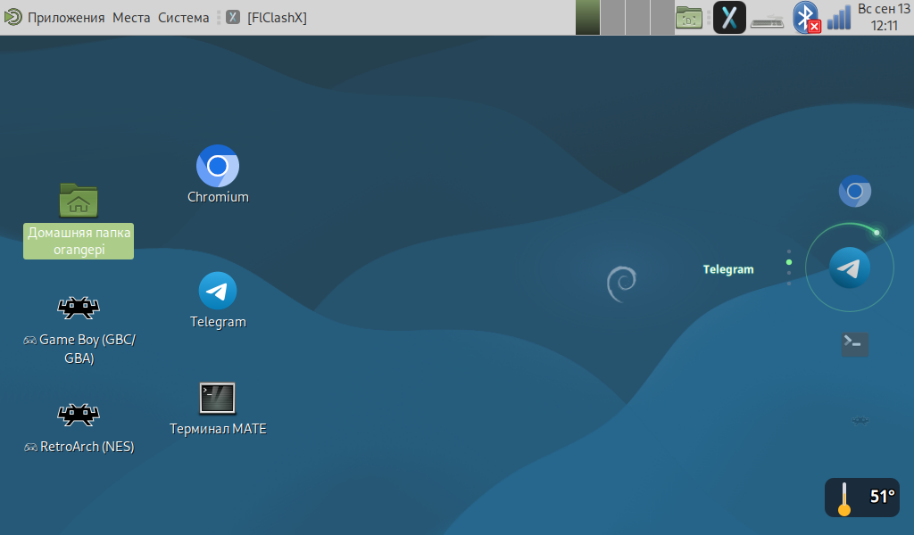
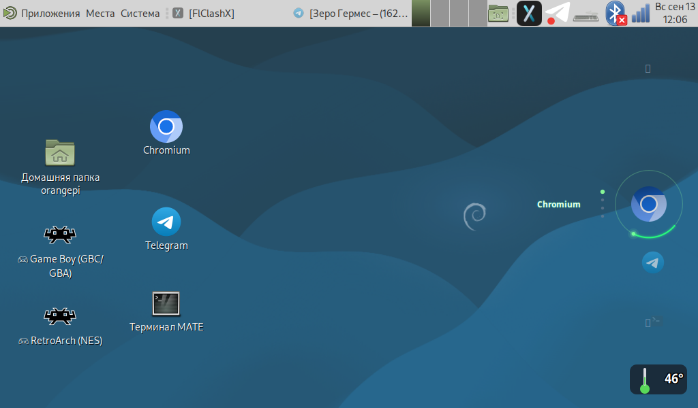
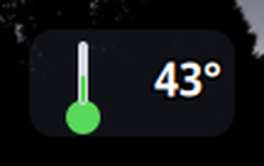
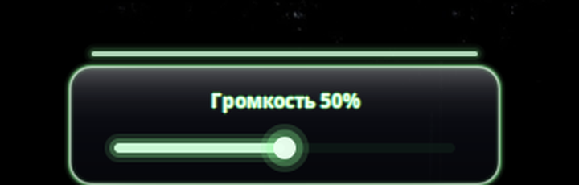

# Виджеты рабочего стола для Orange Pi Zero 3W (X11 / MATE / GTK3)

Лёгкие виджеты для сенсорного рабочего стола на Orange Pi Zero 3W
(Debian 13 Trixie, MATE, X11, экран 1024×600): **вертикальная карусель приложений
с неоновой кометой**, **индикатор температуры CPU** и **шторка громкости
с тёмным жидким стеклом**.

Написаны на Python 3 + GTK3 + Cairo, без тяжёлых зависимостей
(~50 МБ памяти на виджет против ~900 МБ у Chromium-оверлея).



На снимке: **карусель приложений** справа, **шторка громкости** внизу по центру,
**виджет температуры** в правом нижнем углу и **курсор-комета**.

## Возможности

### 🎠 Карусель приложений — вертикальная (`app-carousel-v.py`) ⭐ основной вариант
- Приклеена **справа по центру**, не перекрывает окна приложений
- **Не исчезает** при «показать рабочий стол» (Fn+Enter / Ctrl+Alt+D)
- **Неоновая комета** вокруг активного ярлыка:
  - яркая **голова** (источник света) + затухающий **хвост** позади,
  - **эффект падающего света и тени**: сторона иконки со стороны головы
    подсвечивается, противоположная — в тени (оператор `ATOP` — только по
    непрозрачным пикселям, без чёрного квадрата),
  - мягкая пульсация
- **Светящееся название** активного приложения (горизонтально, слева от кольца)
- **Точки-индикаторы** позиции (вертикально, слева от кольца)
- Прокрутка: колесо мыши ↑↓, **свайп пальцем вверх/вниз** (следует за пальцем)
- Тап по центральной иконке — запуск, по боковой — доводит в центр
- Фон полностью прозрачный; средний клик — закрыть

Ярлыки: **Chromium, Telegram, Терминал (MATE), Домашняя папка, RetroArch (NES)** —
список задаётся в массиве `APPS`.





### 🎠 Карусель приложений — горизонтальная (`app-carousel.py`)
Тот же принцип, но по центру экрана в горизонтальной полосе (тот же неон,
без эффекта кометы).

### 🌡 Индикатор температуры CPU (`cpu-temp-float.py`)
- Плавающий полупрозрачный градусник в правом нижнем углу (Cairo)
- Цвет по нагреву: зелёный < 50°, жёлтый < 70°, красный ≥ 70°
- Обновление каждые 5 секунд; перетаскивается; средний клик — закрыть



### 🔊 Шторка громкости (`volume-drawer.py`)
- **Снизу экрана** — узкая полоска-ручка (3 px) с зелёным неоновым ореолом
- **Тап / свайп вверх** — выдвигается панель с ползунком громкости
- **Полоска едет вместе со свайпом** и возвращается обратно через 2 с бездействия
- Панель с **жидким стеклом (iOS liquid glass)**: размытие фона + подъём насыщенности,
  тёмная тонировка поверх, спекуляр у верхней кромки, свет по боковым кромкам
  и внешняя тень
- Громкость через `pactl` (PipeWire/PulseAudio); тап по полоске не сбивает значение,
  перетаскивание — меняет
- Прозрачный фон окна (RGBA-visual), `override_redirect`, `keep_above` — поверх всех окон

В покое — тонкая полоска-ручка: заметна, но не притягивает взгляд.


По тапу или свайпу выезжает панель с жидким стеклом:



## Требования

- Python 3 с PyGObject (`python3-gi`), Cairo (`python3-cairo`), Pillow (`python3-pil` — размытие «жидкого стекла» в шторке)
- GTK 3, X-сервер (`:0`) и EWMH-совместимый WM (marco / MATE)
- Для SVG-иконок: `librsvg2-common`
- Для громкости: `pactl` — пакет `pulseaudio-utils` (на PipeWire: `pipewire-pulse`)
- Опционально: `xdotool`, `scrot` (диагностика)

Всё сразу проверит и (с `--yes`) доустановит установщик: `./install.sh --yes`

## Установка

```bash
git clone https://github.com/Haidegger22/opi-zero3w-desktop-widgets.git
cd opi-zero3w-desktop-widgets
./install.sh            # проверит зависимости, скопирует скрипты, поставит автозапуск
./install.sh --run      # …и сразу запустит виджеты
```

Флаги: `--yes` — доустановить недостающие пакеты через apt, `--no-autostart` — без автозапуска,
`--run` — запустить сейчас.

⚠️ Установщик **заменяет** уже установленные файлы в `~/.local/bin` и `~/.config/autostart`,
но перед заменой делает бэкапы (`.bak-ГГГГММДД-ЧЧММСС`) и предупреждает, если файл отличается
от репозиторного. Если RetroArch у тебя запускается своим скриптом (например `retrogame.sh` со списком игр) — впиши его в `RETRO_CMD`. По умолчанию значок RetroArch запускает голый `retroarch`, то есть меню самого эмулятора без списка игр
**до** запуска установщика, иначе ярлык будет запускать голый `retroarch`.

<details>
<summary>Ручная установка (без установщика)</summary>

```bash
# 1. Скрипты
mkdir -p ~/.local/bin
install -m 755 app-carousel-v.py app-carousel.py cpu-temp-float.py volume-drawer.py ~/.local/bin/

# 2. Автозапуск — с подстановкой своего $HOME вместо /home/orangepi
mkdir -p ~/.config/autostart
for f in autostart/*.desktop; do
  sed "s|/home/orangepi|$HOME|g" "$f" > ~/.config/autostart/"$(basename "$f")"
done

# 3. Запустить сейчас (в фоне)
DISPLAY=:0 XAUTHORITY=$HOME/.Xauthority ~/.local/bin/app-carousel-v.py &
DISPLAY=:0 XAUTHORITY=$HOME/.Xauthority ~/.local/bin/cpu-temp-float.py &
DISPLAY=:0 XAUTHORITY=$HOME/.Xauthority ~/.local/bin/volume-drawer.py &
```
</details>

Пошаговая инструкция с проверкой и откатом — в **[INSTALL.md](INSTALL.md)**.

## Управление каруселью

| Действие | Что делает |
|---|---|
| Колесо мыши ↑↓ | прокрутка карусели |
| Свайп пальцем (сенсор) | прокрутка (следует за пальцем) |
| Тап по центральной иконке | запуск приложения |
| Тап по боковой иконке | доводит её в центр |
| Средний клик | закрыть виджет |

## Ключевые технические решения

### Тип окна: `DOCK` + `keep_below` (главные грабли)

| Тип окна | Поведение |
|---|---|
| `NORMAL` + `keep_above` | висит поверх всех окон — мешает работать |
| `NORMAL` + `keep_below` | окна перекрывают, но **Fn+Enter (показать рабочий стол) скрывает виджет** (WM делает unmap) |
| `DESKTOP` | не скрывается, но оказывается **под Caja** (иконки стола) — не виден |
| **`DOCK` + `keep_below`** | ✅ не скрывается, окна перекрывают, виден над иконками стола |

```python
self.set_type_hint(Gdk.WindowTypeHint.DOCK)
self.set_keep_below(True)
self.set_skip_taskbar_hint(True)
self.set_skip_pager_hint(True)
self.set_accept_focus(False)
```

### Неоновая комета
- Хвост — 44 сегмента дуги с затуханием яркости `(1-f)^2.2` и толщины
- Голова — 4 слоя свечения (от широкого слабого к яркому ядру)
- Свет/тень на иконке — радиальный градиент от головы + линейный градиент
  к чёрному на противоположной стороне, через `cairo.OPERATOR_ATOP`
  (иначе на прозрачном фоне PNG появляется чёрный квадрат)

### Сон карусели: анимация только когда виджет реально виден

Карусель крутится 30 fps и постоянно перерисовывает полупрозрачные слои — это
греет не столько CPU карусели, сколько Xorg. Поэтому виджет сам проверяет
каждые 220 мс, не закрыт ли он чужим окном (обход стека окон через `Xlib`:
`query_tree` + геометрия всех окон **выше** себя), и в сне полностью
перестаёт вызывать `queue_draw`.

| Состояние | Карусель | Xorg |
|---|---|---|
| рабочий стол открыт (анимация) | 20–27% одного ядра | ~73% |
| рабочий стол закрыт окном (сон) | **0%** | ~21% |

Фаза кометы считается по «времени без сна», поэтому после пробуждения
анимация продолжается ровно с того места, где замерла — без прыжка.

```python
# время анимации не считает время сна
def _now(self):
    if self._pause_start is not None:
        return self._pause_start - self._paused_total
    return time.time() - self._paused_total
```

Есть защита от второго экземпляра (`flock` на `$XDG_RUNTIME_DIR/app-carousel-v.lock`)
и выключатель сна `CAROUSEL_NO_SLEEP=1`.

### Свайп ≠ клик
- смещение > 14 px → **свайп** (прокрутка)
- касание без смещения, короче 0.7 с → **тап** (запуск / центрирование)

## Диагностика

```bash
WID=$(DISPLAY=:0 xdotool search --name "^app-carousel$" | tail -1)
xprop -id $WID _NET_WM_STATE _NET_WM_WINDOW_TYPE
xwininfo -id $WID | grep "Map State"      # IsUnMapped = WM скрыл окно
```

Если виджет «пропал» — проверьте тип окна и флаги (см. таблицу выше).

## Настройка

Основные параметры — в начале `app-carousel-v.py`:

```python
W, H = 240, 430      # размер виджета (ширина включает место под название)
STEP = 86.0          # шаг между иконками
ICON = 52            # базовый размер иконки
CX = W - 66          # центр иконок (у правого края)
NEON = (0.55, 1.00, 0.60)   # цвет неона
MARGIN_RIGHT = 6     # отступ от правого края экрана

CHROMIUM_PROXY = "http://127.0.0.1:7890"  # прокси для Chromium; "" — без прокси (нет FlClash/mihomo)
CHROMIUM_CACHE = "1073741824"             # дисковый кэш Chromium, байт
CHROMIUM_DEBUG_PORT = 9222                # отладочный порт (CDP) для инструментов; 0 — выключить
XCURSOR_THEME  = "comet-hidden"           # тема скрытого курсора; "" — системная
RETRO_CMD      = "bash ~/.openclaw/workspace/retrogame.sh"        # запуск игрового меню со списком игр (не голый retroarch)

APPS = [             # (подпись, файл иконки, команда запуска)
    ("Chromium", ".../chromium.png", _chromium),   # команда собирается из настроек выше
    ...
]
```

Скорость кометы — множитель в `a0 = (time.time() * 1.15) % (2π)`;
длина хвоста — `tail = math.radians(150)`.

### Отладочный порт Chromium (CDP 9222)

Карусель запускает Chromium с `--remote-debugging-port` и `--remote-allow-origins=*`, поэтому
браузер доступен инструментам автоматизации (`http://127.0.0.1:9222`) **сразу после запуска
из карусели — в том числе после перезагрузки**. Без этих флагов порт живёт только до первого
перезапуска браузера, и ломаются: поиск через настоящий браузер (обход капчи) и чтение страниц
с вашими логинами.

Выключается одной строкой: `CHROMIUM_DEBUG_PORT = 0`.

Проверка, что порт поднялся:

```bash
curl -s --noproxy '*' http://127.0.0.1:9222/json/version      # ожидаем строку с "Browser": "Chrome/..."
```

### Шторка громкости (`volume-drawer.py`)

Управление:

| Действие | Что делает |
|---|---|
| Тап по полоске | выдвигает панель (громкость не меняет) |
| Свайп вверх / вниз | выдвигает / убирает панель (полоска едет вместе с жестом) |
| Перетаскивание ползунка | меняет громкость (шаг 5%) |
| 2 с бездействия | панель сама уезжает вниз |

Параметры в начале файла:

```python
W, H = 300, 104          # размер окна шторки
BAR_W, BAR_H = 240, 3    # полоска-ручка (толщина)
PANEL_H = 74             # высота выдвижной панели
NEON = (0.55, 1.00, 0.60)  # цвет неона (общий с каруселью и курсором)
HIDE_AFTER = 2.0         # секунд бездействия до автоскрытия

# «Жидкое стекло» (iOS liquid glass)
BLUR = 16                # радиус размытия подложки
SAT = 1.65               # подъём насыщенности фона — подпись iOS
BRIGHT = 1.06            # подъём яркости подложки
GLASS_A = 0.90           # непрозрачность самого стекла
TINT_A = 0.60            # тёмная тонировка поверх стекла
```

**Как крутить под себя:** главная ручка — `TINT_A`. Меньше (0.50) — прозрачнее и
«стекляннее»; больше (0.75) — плотнее и темнее. Учтите: жидкое стекло по определению
зависит от фона — над тёмным контентом панель тёмная, над белым становится
серо-молочной (так же ведёт себя iPhone). Это свойство, а не дефект.

## Совместимость

Проверено на: Orange Pi Zero 3W (Allwinner A733, arm64), Debian 13 Trixie,
MATE 1.26, marco, экран 1024×600 (HDMI + USB-тач).
Скрипты используют X11 — на Wayland не проверялись.

## Связанные проекты

- **[opi-zero3w-cursor-comet](https://github.com/Haidegger22/opi-zero3w-cursor-comet)** — курсор-комета для X11/MATE с собственной отрисовкой и полным скрытием системного курсора: то же неоновое семейство, что и комета в карусели.

## Лицензия

MIT — см. [LICENSE](LICENSE).
